临海市2025年1月九年级上期末数学

一、选择题 (本题有 10 小题, 每小题 3 分, 共 30 分. 请选出各题中只有一个符合题意的正确选项, 不选、 多选、错选, 均不给分.)

1.下列图案中,是中心对称图形但不是轴对称图形的是（  ）.

A.
B.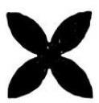
C.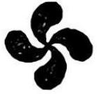
D.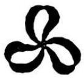

2.下列事件中, 属于随机事件的是（  ）.

A. 把实心铁球放入水中, 铁球会沉入水底

B. 测量三角形的三个内角,其和等于 ${360}^{ \circ  }$

C. 随机抽取九年级 (1) 班 10 名学生测量视力,该班的小明同学参加视力测量

D. 对九年级 (1) 班的每一名学生测量视力,该班的小明同学参加视力测量

3.一元二次方程 ${x}^{2} - {16} = 0$ 的解为（  ） .

A.x=4 B. $x =  - 4$ C. ${x}_{1} = 0,{x}_{2} = {16}$ D. ${x}_{1} = 4,{x}_{2} =  - 4$

4.如图, ${AB}$ 是 $\odot  O$ 的一条弦,直径 ${CD}\bot {AB}$ ,垂足为 $E$ ,下列结论不一定成立的是（  ）.
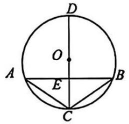
A. ${AE} = {BE}$ B. $\overset{⏜}{AD} = \overset{⏜}{BD}$ C. ${AC} = {BC}$ D. ${OE} = {CE}$

5. 小张从《山海经》、《昆虫记》、《艾青诗集》3 本书中随机拿两本书,恰好拿到《山海经》和《昆虫记》的概率是（  ）.

A. $\frac{1}{3}$ B. $\frac{1}{6}$ C. $\frac{1}{2}$ D. $\frac{2}{9}$

6.若关于 $x$ 的一元二次方程 ${x}^{2} + {2x} + k = 0$ 有两个不相等的实数根,则 $k$ 的取值范围是（  ）.

A. $k > 1$ B. $k < 1$ C. $k <  - 1$ D. $k >  - 1$

7.如图,菱形 ${ABCD}$ 的顶点 $B, C, D$ 在 $\odot  A$ 上,若 ${AB} = 4,\angle {ABC} = {60}^{ \circ  }$ ,则图中阴影部分的面积为（  ） 
A. $\frac{16\pi }{3} - 8\sqrt{3}$ B. $\frac{4\pi }{3} - 8\sqrt{3}$ C. $\frac{4\pi }{3} - 4\sqrt{3}$ D. $\frac{16\pi }{3} - 4\sqrt{3}$
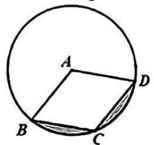

8.如图, $B, A, D$ 三点在同一直线上, $\bigtriangleup  {ADE}$ 和 $\bigtriangleup  {ABC}$ 都是等腰直角三角形,连接 ${CD}$ . 把 $\bigtriangleup  {ADE}$ 绕点 $A$ 逆时针旋转一个角度 $\alpha \left( {{0}^{ \circ  } \leq  \alpha  \leq  {180}^{ \circ  }}\right)$ ,当 ${CD} = {CE}$ 时, $\alpha$ 的度数是（  ）
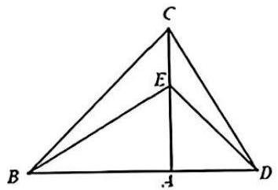

A. ${30}^{ \circ  }$ B. ${45}^{ \circ  }$ C. ${60}^{ \circ  }$ D. ${135}^{ \circ  }$

9.抛物线 $y = a{x}^{2} + {bx} + c$ 的部分图象如图所示,对称轴为直线 $x =  - 1$ ,抛物线与 $x$ 轴的一个交点是(1,0). 下列结论正确的是（  ）
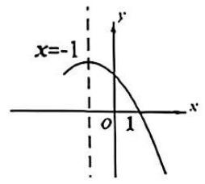

A. ${16a} + c > {4b}$ B. ${16a} + c < {4b}$ C. ${16a} + c = {4b}$ D. ${16a} + c$ 与 ${4b}$ 的大小关系不确定

10. 如图,已知线段 ${AB}$ 和线段 ${AC},{AB} \bot  {AC}$ . 点 $D$ 先沿着线段 ${AB}$ 从点 $B$ 匀速运动到点 $A$ ,再沿着射线 ${AC}$ 方向以同样的速度运动; 点 $D$ 出发的同时点 $E$ 从点 $C$ 出发,以相同的速度沿着射线 ${AC}$ 的方向运动; 对于 $D, E$ 两点间的距离的变化情况,下列说法正确的是（  ）
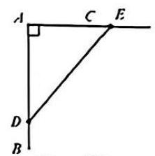
A. 先变大后变小, 最后不变; B. 先变小后变大, 最后不变;

C. 当 ${AB} > {AC}$ 时,先变小后变大,最后不变; D. 当 ${AB} < {AC}$ 时,先变大后变小,最后不变.

二、填空题 (本题有 6 小题, 每小题 3 分, 共 18 分. 在答题卷的相应位置直接填写答案.)

11. 在平面直角坐标系中,点(2, - 1)关于原点对称的点的坐标为$\underline{\quad\quad}$

12. 已知关于 $x$ 的一元二次方程 ${x}^{2} + {3x} - c = 0$ 的两根为 2 和 $m$ ,则 $m + 2$ 的值为$\underline{\quad\quad}$

13. 某兴趣小组通过实验研究一批绿豆的发芽率, 实验结果如下表所示:

<table style="width: auto;" border="1"><tr><td>每批粒数n</td><td>100</td><td>300</td><td>400</td><td>600</td><td>1000</td><td>2000</td><td>3000</td></tr><tr><td>发芽的粒数m</td><td>90</td><td>280</td><td>352</td><td>554</td><td>930</td><td>1864</td><td>2793</td></tr><tr><td>发芽频率</td><td>0.900</td><td>0.933</td><td>0.880</td><td>0.923</td><td>0.930</td><td>0.932</td><td>0.931</td></tr></table>

估计这批绿豆中每一粒绿豆发芽的概率是$\underline{\quad\quad}$(保留小数点后 2 位).

14. 如图,在扇形 ${OAB}$ 中,圆心角 $\angle {AOB} = {130}^{ \circ  }, C$ 是 $\overset{⏜}{AB}$ 上的点, $\angle {AOC} = {90}^{ \circ  }$ , 则 $\angle {CAB}$ 的度数为$\underline{\quad\quad}$
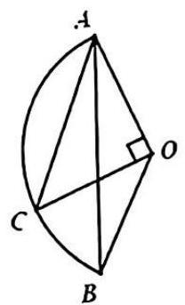

15. 抛物线 $y = 2{x}^{2} + {bx} + c$ 与直线 $y = 1$ 只有一个交点,且过点 $A\left( {m + 2, n}\right) ,\mathrm{B}\left( {m - 6, n}\right)$ , 则 $n$ 等于$\underline{\quad\quad}$

16. 如图,把正方形 ${ABCD}$ 的对角线 ${AC}$ 绕着顶点 $A$ 旋转到 ${AE}$ ,以 ${AE}$ 为一边作正方形 ${AEFG}$ ,过 $E, C$ 作直线 ${EC}$ ,过 $G$ 作 ${GH}\bot {EC}$ ,垂足为 $H$ ,连接 ${FH}$ ,则 $\frac{EC}{FH}$ 的值是$\underline{\quad\quad}$
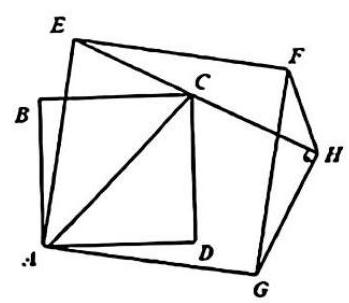

三、解答题(本题有 8 小圆、淌分 72 分,第 17-21 圆可圆 8 分,第 22 ~ 23 圆每题 10 分,第 24 题 12 分)

17. 解方程, (1) ${x}^{2} - x = 0$ ; (2) ${x}^{2} + {6x} = 2$ .

18. 投掷两枚相同的质地均匀的骰子,骰子六个面上的点数分别为1,2,3,4,5,6. 求两枚骰子朝上一面的点数之和为 3 的倍数的概率.

19. 某药品经过两次连续降价后,其单价下降了 36%,问:该药品平均每次降价的百分率是多少？

20. 如图 1,在 $\odot  O$ 的内接四边形 ${ABCD}$ 中, ${BC} = {DC}$ . 连接 ${AC}$ . ${BD}$ . 过点 $C$ 作 ${BD}$ 的平行线,分别与 ${AB},{AD}$ 的延长线交于点 $E, F$ .

( 1 )求证: ${EF}$ 是 $\odot  O$ 的切线.

(2)如图 2,若 ${AB}$ 是 $\odot  O$ 的直径, ${AB} = {10},{AC} = {BD}$ ,求 ${CE}$ 的长.

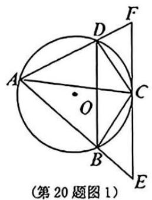

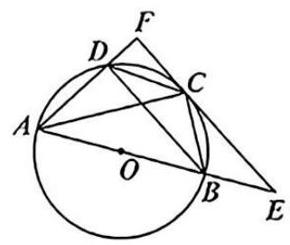

(第 20 题图 2)

21. 我们可以用新的观点理解和探究旋转及其性质. 如图 1,平面内的每一个点都绕着这个平面上的某一个固定点 $O$ 旋转相同的角度 $\alpha$ ,这种平面的运动叫平面的旋转,点 $O$ 叫旋转中心,角度 $\alpha$ 叫旋转角.一个点与其运动后的点叫对应点; 平面上两点所确定的直线与其对应点所确定的直线叫对应直线; 两点所连线段与其对应点所连线段叫对应线段；以一点为端点经过另一点的射线与其对应点所确定的射线叫对应射线; 两条射线所成的角与其对应射线所成的角叫对应角.平面旋转的对应点有如下性质: 对应点到旋转中心的距离相等,如图 1 中 ${OA} = {O{A}^{\prime }}$ .

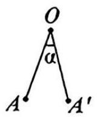

(第 21 题图 1)

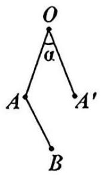

(第 21 题图 2)

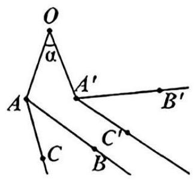

(第 21 题图 3)

(1)如图 2,已知平面上的线段 ${AB}$ ,用圆规和没有刻度的直尺在图上作出线段 ${AB}$ 关于平面旋转后的对应线段 ${A}^{\prime }{B}^{\prime }$ (保留作图痕迹,不要求写作法),并依据对应点的性质证明对应线段 ${AB} = {A}^{\prime }{B}^{\prime }$ .

(2)如图 3,若 $\angle {BAC}$ 关于平面旋转后的对应角为 $\angle {{B}^{\prime }{A}^{\prime }{C}^{\prime }}$ ,依据对应点和对应线段的性质证明 $\angle {BAC} = \angle {B}^{\prime }{A}^{\prime }{C}^{\prime }$ .

22. 二次函数 $y = {x}^{2} + {bx} + c$ 的图象经过点(4, - 2),且对称轴为直线 $x = 1$ .

(1)求这个二次函数的解析式.

(2)图象上的点(x, x)称为函数的不动点,求这个函数不动点的坐标.

(3)若 $P\left( {x, y}\right)$ 是二次函数图象上不动点之间的点(包括端点),求 $y$ 的最大值与最小值的差.

23. 如图 1, $A, B$ 是 $\odot  O$ 上点,连接 ${OA},{OB}$ ,分别过 $A, B$ 两点作 ${OB},{OA}$ 的平行线,交 $\odot  O$ 于点 $D$ ,点 $C$ ,分别过 $A, B$ 作 $\odot  O$ 的切线交于点 $E$ ,连接 ${OD},{OC}$ .

(1) 求证: ${AD} = {BC}$ .

(2)如果 $\odot  O$ 的半径为 4 .

①若 $C, O, D$ 在同一直线上,求 $\overset{⏜}{AB}$ 的长.

②如图 2,若 $\angle {AOB} = {45}^{ \circ  }$ ,求阴影部分的面积.

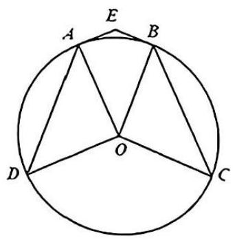

(第 23 题图 1)

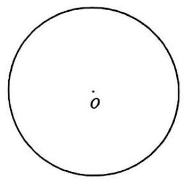

(第 23 题备用图)

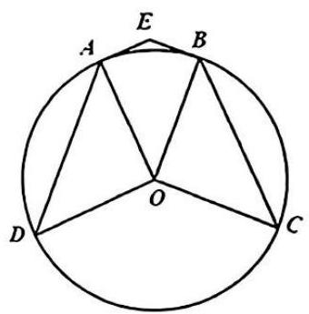

(第 23 题图 2)

24. 综合实践小组研究某个篮球自由落地和反弹现象.

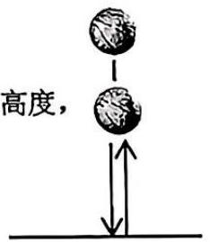

实验探索: 该小组把该篮球从不同的高度放开, 让其自由落下, 测量其落地后反弹的高度, 得到数据如下表:

<table  style="width: auto;" border="1"><tr><td>试次</td><td>第 1 次</td><td>第 2 次</td><td>第 3 次</td><td>第 4 次</td><td>第 5 次</td></tr><tr><td>下落高度/cm</td><td>80</td><td>90</td><td>100</td><td>110</td><td>120</td></tr><tr><td>反弹高度/cm</td><td>40</td><td>45</td><td>50</td><td>56</td><td>60</td></tr></table>

任务1:请选择适当的函数模型描述该篮球反弹高度与下落高度之间的关系,设出变量,求出函数解析式. 解决问题: 该小组进一步提出研究篮球各次反弹的最高点出现的时间间隔规律,经查阅资料发现,篮球第一次从高度为 ${h}_{0}$ (单位: $\mathrm{m}$ )处落下到达地面的运动过程中,其高度 $h$ (单位: $\mathrm{m}$ )与运动时间 $t$ (单

位: s)的函数关系是 $h = {h}_{0} - \frac{1}{2}g{t}^{2}$ ,其中 $\mathrm{g}$ 为重力加速度. 第一次自由下落及以后每次反弹再落地的过程中, 篮球离地高度都是运动时间的二次函数, 且它们的二次项系数相同.

任务 2:根据任务 1 中发现的规律,求篮球从高为 ${h}_{0}$ (单位: $\mathrm{m}$ )处下落到第一次反弹到最高点所用的时间 (用只含已知量 ${h}_{0}, g$ 的式子表示).

任务 3:篮球从 ${100}\mathrm{\;{cm}}$ 处下落, $\mathrm{g}$ 的值取 ${10}\mathrm{\;m}/{\mathrm{s}}^{2}$ . 当篮球反弹高度小于 $2\mathrm{\;{cm}}$ 时,下次不再反弹. 直接写出篮球反弹的总次数,并用式子表示篮球从第 $n$ 次反弹最高点运动到第 $n + 1$ 次反弹最高点间隔的时间 (用只含反弹次数 $n$ 的式子表示).

数学参考答案和评分细则
1. 答案：C
【解析】略
2. 答案：C
【解析】略
3. 答案：D
【解析】略
4. 答案：D
【解析】略
5. 答案：A
【解析】略
6. 答案：B
【解析】略
7. 答案：A
【解析】略
8. 答案：B
【解析】略
9. 答案：B
【解析】略
10. 答案：C
【解析】略
11. 答案：(-2,1) 
【解析】略
12. 答案：-3
【解析】略
13. 答案： 0.93
【解析】略
14. 答案：${20}^{ \circ  }$ 
【解析】略
15. 答案：33
【解析】略
16. 答案：$\sqrt{2}$
【解析】略

三、解答题(本题有 8 小题,第 17~21 题每题 8 分,第 22,23 题每题 10 分,第 24 题 12 分,共 72 分)

17. 答案：（1）0和1 （2）${x}_{1} =  - 3 + \sqrt{11},{x}_{2} =  - 3 - \sqrt{11}$ 
【解析】(1) ${x}^{2} - x = 0$

解: $x\left( {x - 1}\right)  = 0$

${x}_{1} = 0,{x}_{2} = 1$

(2) ${x}^{2} + {6x} = 2$

解: ${x}^{2} + {6x} + 9 = 2 + 9$

${\left( x + 3\right) }^{2} = {11}$

$x + 3 =  \pm  \sqrt{11}$

${x}_{1} =  - 3 + \sqrt{11},{x}_{2} =  - 3 - \sqrt{11}$

18. 答案：$\frac{1}{3}$
【解析】解: 列表如下:

<table  style="width: auto;" border="1"><tr><td>和</td><td>1</td><td>2</td><td>3</td><td>4</td><td>5</td><td>6</td></tr><tr><td>1</td><td>2</td><td>3</td><td>4</td><td>5</td><td>6</td><td>7</td></tr><tr><td>2</td><td>3</td><td>4</td><td>5</td><td>6</td><td>7</td><td>8</td></tr><tr><td>3</td><td>4</td><td>5</td><td>6</td><td>7</td><td>8</td><td>9</td></tr><tr><td>4</td><td>5</td><td>6</td><td>7</td><td>8</td><td>9</td><td>10</td></tr><tr><td>5</td><td>6</td><td>7</td><td>8</td><td>9</td><td>10</td><td>11</td></tr><tr><td>6</td><td>7</td><td>8</td><td>9</td><td>10</td><td>11</td><td>12</td></tr></table>

由表可知, 一共有 36 种等可能的结果, 其中投掷两枚骰子朝上一面的点数的和是 3 的倍数的结果有 12 种情况.

$\therefore$ 两枚骰子朝上一面的点数的和是 3 的倍数的概率 $\mathrm{P} = \frac{12}{36} = \frac{1}{3}$

19. 答案：0.2
【解析】解: 设该药品平均每次降价的百分率是 $x$ ,由题意可列方程

${\left( 1 - x\right) }^{2} = 1 - {36}\%$

解得: ${x}_{1} = {0.2},{x}_{2} = {1.8}$ (不合题意,舍去)

答: 该药品平均每次降价的百分率是 20%. 
20.  答案：（1） 证明见解析（2）$5\sqrt{3}$
【解析】(1) 证明: 连接 ${OC}$ , $\because {BC} = {CD}$ , $\therefore \overset{⏜}{BC} = \overset{⏜}{CD}$ $\therefore {OC} \bot  {BD}$ $\because {BD}//{EF}\;\therefore {OC} \bot  {EF}$ 而 ${OC}$ 是半径, $\therefore {EF}$ 是 $\odot  O$ 的切线 
(2)连接 ${OC}$ , $\because {AC} = {BD},{BC} = {DC}$ $\therefore {AC} = {BD},{BC} = {DC}$ $\therefore \overset{⏜}{AC} - \overset{⏜}{CD} = \overset{⏜}{BD} - \overset{⏜}{CD}$ ,即 $\overset{⏜}{AD} = \overset{⏜}{BC}$ $\therefore \overset{⏜}{AD} = \overset{⏜}{BC} = \overset{⏜}{DC}\;\therefore \angle {AOD} = \angle {COB} = \angle {COD} = {60}^{ \circ  }$ $\therefore \angle {BAC} = \angle {ABD} = {30}^{ \circ  }$ $\because {AB}$ 是直径 $\therefore \angle {ACB} = {90}^{ \circ  }$ $\because {AB} = {10}\therefore {BC} = 5,{AC} = 5\sqrt{3}$ $\because {BD}//{EF}\;\therefore \angle E = \angle {ABD} = \angle {BAC} = {30}^{ \circ  }$ $\therefore {CE} = {AC} = 5\sqrt{3}$ 
21.  答案：见解析（1） （2）见解析
【解析】(1)尺规作图答案如下:

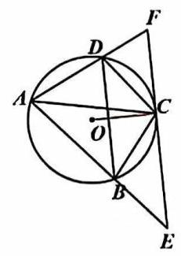

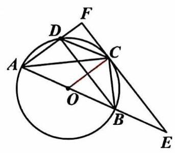

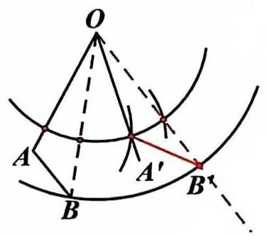

证明: 如上图, $A$ 与 ${A}^{\prime }, B$ 与 ${B}^{\prime }$ 是两组对应点,由题意可得 ${OA} = O{A}^{\prime },{OB} = O{B}^{\prime }$ $\because$ 旋转角度相同 $\therefore \angle {AOA}$ ’ $= \angle {BOB}$ ’

$\therefore \angle {AOA}$ ’ $- \angle {BOA}$ ’ $= \angle {BOB}$ ’ $- \angle {BOA}$ ’即 $\angle {AOB} = \angle A$ ’ ${OB}$ ’

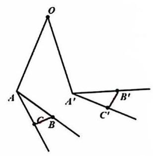

$\therefore  \bigtriangleup  {AOB} \cong   \bigtriangleup  {A’{OB}}$ ’(SAS)

$\therefore {AB} = {A}^{\prime }{B}^{\prime }$

(2) 连接 ${BC}$ 和 ${B}^{\prime }{C}^{\prime }$

$\because \angle {BAC}$ 的对应角是 $\angle B$ ’ $A$ ’ $C$ ’

$\therefore A$ 与 ${A}^{\prime }, B$ 与 ${B}^{\prime }$ 和 $C$ 与 ${C}^{\prime }$ 是三组对应点

$\therefore$ 由 (1) 可得 ${AC} = {A}^{\prime }{C}^{\prime },{AB} = A{B}^{\prime },{BC} = {B}^{\prime }{C}^{\prime }$

$\therefore  \bigtriangleup  {BAC} \cong   \bigtriangleup  {B’}A’C’$ (SSS)

$\therefore \angle {BAC} = \angle {B}^{\prime }{A}^{\prime }{C}^{\prime }$

22.  答案：（1）$y = {x}^{2} - {2x} - {10}$ （2）(-2,-2)和（5,5） （3）16
【解析】解: (1)二次函数 $y = {x}^{2} + {bx} + c$ 的对称轴为直线 $x = 1$

$\therefore  - \frac{b}{2} = 1$ 解得: $b =  - 2$

$\because$ 图像经过点(4, - 2)

$\therefore  - 2 = {4}^{2} + {4b} + c$

解得: $c =  - {10}$

$\therefore$ 这个二次函数的解析式是 $y = {x}^{2} - {2x} - {10}$

(2)根据题意可得: $x = {x}^{2} - {2x} - {10}$

解得: ${x}_{1} =  - 2.{x}_{2} = 5$

$\therefore$ 这个函数不动点的坐标是(-2, - 2)和(5,5)

(3) $\because$ 二次函数对称轴为直线 $x = 1$ ,函数图像开口向上

$\therefore$ 当 $x = 1$ 时, $y$ 取到最小值,且 $y =  - {11}$

$\because$ 不动点(-5, - 5)离对称轴更远

$\therefore$ 当 $x = 5$ 时, $y$ 取到最大值 5

$\therefore y$ 的最大值与最小值之差是 $5 - \left( {-{11}}\right)  = {16}$

23.  答案：（1）证明见解析 （2）①$\frac{4}{3}\pi$② ${16}\sqrt{2}$
【解析】证明: $\left( 1\right) \because {OB}//{DA},{OA}//{BC}$

$\therefore \angle {BOA} = \angle {OAD},\angle {BOA} = \angle {OBC}$ .

$\therefore \angle {OAD} = \angle {OBC}$

$\because {OA} = {OD},{OB} = {OC}$

$\therefore \angle {ODA} = \angle {OAD},\angle {OCB} = \angle {OBC}$

$\therefore \angle {BOA} = \angle {ODA} = \angle {OAD} = \angle {OCB} = \angle {OBC}$

又 $\because \angle {AOD} = {180}^{ \circ  } - \angle {OAD} - \angle {ODA}$

$\angle {COB} = {180}^{ \circ  } - \angle {OBC} - \angle {OCB}$

$\therefore \angle {AOD} = \angle {COB}$

$\therefore {AD} = {BC}$

(2) ① $\because {OB}//{DA}$

$\therefore \angle {BOC} = \angle {ADO}$

$\because$ 由 (1) 可得 $\angle {BOA} = \angle {ODA},\angle {AOD} = \angle {COB}$

$\therefore \angle {BOC} = \angle {AOD} = \angle {BOA}$

$\therefore \angle {BOA} = \frac{1}{3} \times  {180}^{ \circ  } = {60}^{ \circ  }$

$\therefore$ 弧 ${AB}$ 的长 $= \frac{60\pi 4}{180} = \frac{4}{3}\pi$

②延长 ${EA}$ 和 ${OB}$ 相交于点 $F$

由 $\angle {AOB} = {45}^{ \circ  },{AE},{BE}$ 与 $○ \mathrm{O}$ 相切, $\therefore \angle {OAF} = \angle {EBF} = {90}^{ \circ  },\angle F = {45}^{ \circ  }$

可得 $\bigtriangleup {AOF}$ 和 $\bigtriangleup {EBF}$ 是等腰直角三角形

${OA} = 4$ ,可得 ${AF} = 4,{OF} = 4\sqrt{2}$

$\therefore {BF} = {OF} - {OB} = 4\sqrt{2} - 4$

$\therefore {BE} = {BF} = 4\sqrt{2} - 4$ 2 分

连接 ${OE}\therefore {S}_{\text{刚出 }} = 2 \cdot  {S}_{\text{长正 }}{}_{OCBE} = 2 \times  \frac{1}{2}{OB}\left( {{BE} + {OC}}\right)$

$= 2 \times  \frac{1}{2} \times  4\left( {4\sqrt{2} - 4 + 4}\right)  = {16}\sqrt{2}$ .

用下面方法也酌情给分:

${t}^{\prime } = \sqrt{\frac{1}{5} \times  {\left( \frac{1}{2}\right) }^{n + 1}} + \sqrt{\frac{1}{5} \times  {\left( \frac{1}{2}\right) }^{n}} = \sqrt{\frac{1}{5} \times  {\left( \frac{1}{2}\right) }^{n}}\left( {\frac{\sqrt{2}}{2} + 1}\right)$

方法二:

任务二 $\because$ 由 (1) 可得第一次反弹后最高点的高度是 $\frac{{h}_{0}}{2}$

$\therefore$ 设第一次反弹后的函数解析式为 $h =  - \frac{1}{2}g{\left( t - h\right) }^{2} + \frac{{h}_{0}}{2}$

图象经过点 $\left( {\frac{\frac{\sqrt{2{h}_{0}g}}{g}}{g},0}\right)$ 代入函数解析式可得 $0 =  - \frac{1}{2}g{\left( \frac{\sqrt{2{h}_{0}g}}{g} - h\right) }^{2} + \frac{{h}_{0}}{2}$

解得 $h = \frac{\sqrt{{h}_{o}g}}{g} + \frac{\sqrt{2{h}_{0}g}}{g}$

即: 所用时间是 $\frac{\sqrt{{h}_{0}g}}{g} + \frac{\sqrt{2{h}_{0}g}}{g}$

任务三: ${100} \div  {\left( \frac{1}{2}\right) }^{6} = \frac{25}{16} < 2$ ,反弹 6 次

最开始从最高点到落地的时间 ${t}_{0} = \sqrt{\frac{2{h}_{0}}{g}} = \sqrt{\frac{2 \times  1}{10}} = \frac{\sqrt{5}}{5}$

第 1 次反弹到最高点的时间 ${t}_{1} = \sqrt{\frac{2 \times  \frac{1}{2}}{10}} = \frac{\sqrt{10}}{10} = \frac{\sqrt{5}}{5} \times  \frac{\sqrt{2}}{2}$

第 $\mathrm{n}$ 次反弹到最高点的时间 ${t}_{\mathrm{n}} = \frac{\sqrt{5}}{5} \times  {\left( \frac{\sqrt{2}}{2}\right) }^{n}$

第 $\mathrm{n} + 1$ 次反弹到最高点的时间 ${t}_{\mathrm{n} + 1} = {t}_{n} \times  \left( \frac{\sqrt{2}}{2}\right)  = \frac{\sqrt{5}}{5} \times  {\left( \frac{\sqrt{2}}{2}\right) }^{n + 1}$

${t}^{\prime } = \frac{\sqrt{5}}{5} \times  {\left( \frac{\sqrt{2}}{2}\right) }^{n} + \frac{\sqrt{5}}{5} \times  {\left( \frac{\sqrt{2}}{2}\right) }^{n + 1} = \left( {\frac{\sqrt{5}}{5} + \frac{\sqrt{10}}{10}}\right) {\left( \frac{\sqrt{2}}{2}\right) }^{n} = \left( \frac{2\sqrt{5} + \sqrt{10}}{10}\right) {\left( \frac{\sqrt{2}}{2}\right) }^{n}$ ${S}_{\text{引噬 }} = {S}_{\text{四边形 AOBE }} + {S}_{\bigtriangleup {AOD}} + {S}_{\bigtriangleup {COB}} = {S}_{\bigtriangleup {AOF}} - {S}_{\bigtriangleup {EBF}} + {S}_{\bigtriangleup {AOD}} + {S}_{\bigtriangleup {COB}}$ 
24.  答案：（1）$y = {0.5x}$  （2）$\frac{\sqrt{{h}_{o}g}}{g} + \frac{\sqrt{2{h}_{0}g}}{g}$ （3）$\sqrt{\frac{1}{5} \times  {\left( \frac{1}{2}\right) }^{n + 1}}$
【解析】解: 任务一: 设下落高度为 $x$ ,反弹高度为 $y$ ,令 $y = {kx} + b$ , 当 $x = {80}, y = {40};x = {90}, y = {45}$ 时,

$\left\{  \begin{array}{l} {80k} + b = {40} \\  {90k} + b = {45} \end{array}\right.$

得 $\left\{  \begin{matrix} k = {0.5} \\  b = 0 \end{matrix}\right.$ $\therefore y = {0.5x}$ 
任务二: 当 $\mathrm{h} = 0$ 时, ${h}_{0} - \frac{1}{2}g{t}^{2} = 0$ $\therefore t = \sqrt{\frac{2{h}_{0}}{g}} = \frac{\sqrt{2{h}_{0}g}}{g}$ 当 $h = 0$ 时, $\frac{{h}_{0}}{2} - \frac{1}{2}g{t}^{2} = 0$ $\therefore t = \sqrt{\frac{{h}_{0}}{g}} = \frac{\sqrt{{h}_{0}g}}{g}$ 所用时间是 $\frac{\sqrt{{h}_{o}g}}{g} + \frac{\sqrt{2{h}_{0}g}}{g}$ 
任务三:反弹 6 次第 1 次, 第 2 次, 第 3 次 第 4 次 第 5 次 第 6 次 ${100} \div  2 = {50},{50} \div  2 = {25},{25} \div  2 = {12.5},{12.5} \div  2 = {6.25},{6.25} \div  2 = {3.125},{3.125} \div  2 = {1.0625}$ 最开始从最高点到落地的时间 ${t}_{0} = \sqrt{\frac{2{h}_{0}}{g}} = \sqrt{\frac{2 \times  1}{10}} = \frac{\sqrt{5}}{5}$ 第 1 次反弹到最高点的时间 ${t}_{1} = \sqrt{\frac{2 \times  1 \times  \frac{1}{2}}{10}} = \frac{\sqrt{10}}{10}$ 第 $\mathrm{n}$ 次反弹到最高点的的时间 ${t}_{\mathrm{n}} = \sqrt{\frac{2 \times  1 \times  {\left( \frac{1}{2}\right) }^{n}}{10}} = \sqrt{\frac{1}{5} \times  {\left( \frac{1}{2}\right) }^{n}}$ 第 $\mathrm{n} + 1$ 次反弹到最高点的的时间 ${t}_{\mathrm{n} + 1} = \sqrt{\frac{2 \times  1 \times  {\left( \frac{1}{2}\right) }^{n + 1}}{10}} = \sqrt{\frac{1}{5} \times  {\left( \frac{1}{2}\right) }^{n + 1}}$